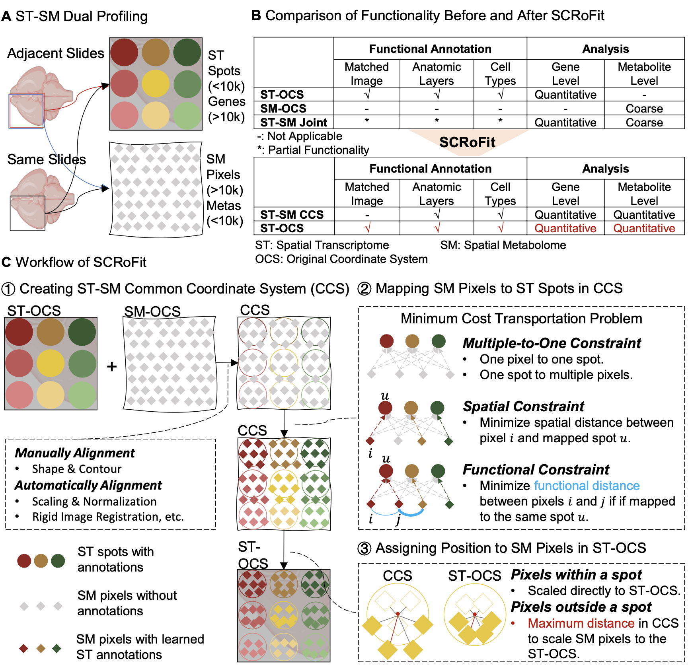

# SCRoFit

Welcome to the official documentation of **SCRoFit**!

## Overview




## Getting Started

Want to start using it immediately? Check out the [Installation Guide](installation.md).


## Tutorial Guide
The followings are tutorials of how to use SCRoFit in different scenarios:

-   [Run SMA data with SCRoFit](tutorial/run_SCRoFit_SMA.ipynb)
-   [Run Age data with SCRoFit](tutorial/run_SCRoFit_Age.ipynb)


## Citation

If you use SCRoFit in your research, please cite the following paper:

APA format:

```
To be continued.
```

BibTeX format:

```bibtex
To be continued.
```